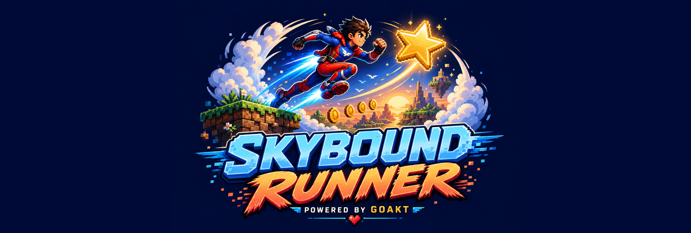
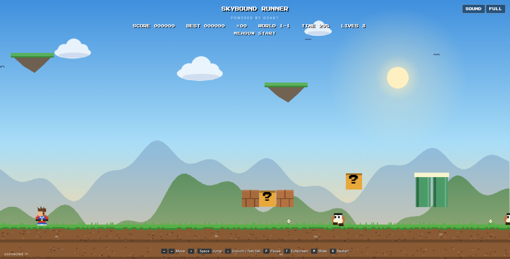
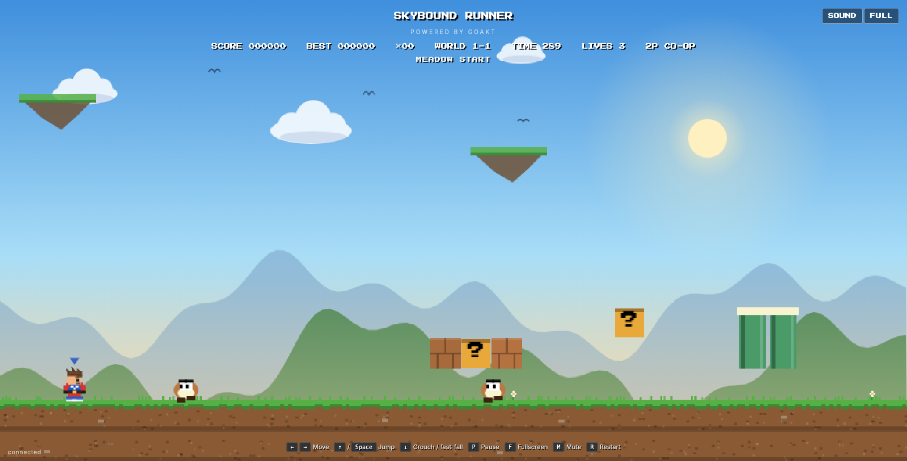
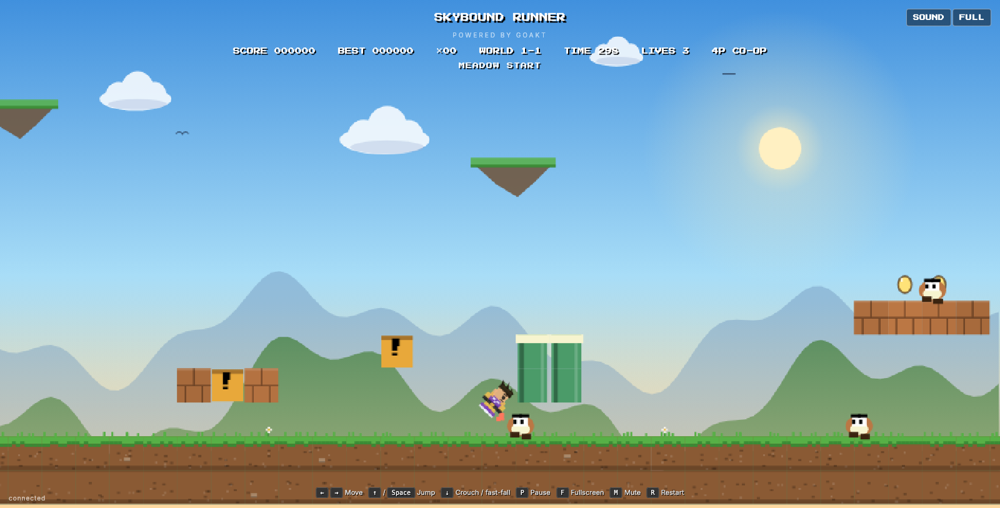

# Skybound Runner — Browser Game powered by GoAkt

<p align="center">
  <a href="https://github.com/Tochemey/skybound-runner/actions/workflows/ci.yml"></a>
  <a href="go.mod"></a>
  <a href="LICENSE"></a>
  <a href="https://github.com/Tochemey/goakt"></a>
</p>

<p align="center">
  
</p>

An original browser-playable retro platformer built on [GoAkt](https://github.com/Tochemey/goakt) — with **drop-in co-op multiplayer**: browser tabs that connect close together share one game world, up to four players per match. The game is fully server-authoritative: a `GameActor` simulates physics for every player at 60 Hz and streams personalized state snapshots to each browser, which is a pure renderer — no game logic runs client-side.

The campaign spans 10 stages across three worlds: **Sunny Fields** (3 stages), **Pipe Works** (3), and **Ember Ruins** (4). All Canvas art, particle effects, and looping Web Audio chiptunes are original procedural assets generated in code; the project ships no third-party game art, music, or level data.

| Solo                                     | Co-op                                           | In flight                                                |
|------------------------------------------|-------------------------------------------------|----------------------------------------------------------|
|  |  |  |

## Gameplay

- **Run, jump, stomp** — variable jump height (release early for a short hop), a 6-tick jump buffer, and coyote time make the platforming forgiving without allowing double jumps.
- **Crouch & fast-fall** — Down ducks under low-flying enemies (smaller hitbox) on the ground and slams you downward in the air.
- **Three enemy kinds** — crawlers patrol and turn at ledges; flyers bob on sine paths and must be stomped from above or ducked under; spiky walkers can never be stomped — all contact hurts.
- **Shield power-up** — some question blocks release a sliding energy orb instead of a coin. It absorbs one hit, with a brief invulnerability window after it breaks. Pits and the timer are always fatal.
- **Checkpoints** — a mid-stage pennant lights up gold once any player passes it; later deaths respawn there instead of the stage entrance.
- **Coins matter** — every 100 coins converts to an extra life. In co-op the lives pool, score, and coins are shared; the campaign ends when the pool runs dry.
- **Best score** — your highest score persists in the browser (localStorage) and shows in the HUD.

## Co-op

Open the game in several browsers (or tabs) within a short window and the matchmaker seats them in the same match — up to 4 players, each with their own suit color and a marker over teammates' heads. Any player reaching the flag clears the stage for everyone; lives are a shared pool. A match that fills (or dies out) makes the matchmaker spawn a fresh one for the next connection.

## Architecture

```ascii
Browser (Canvas + Web Audio)
     │  JSON over WebSocket
     ▼
Gateway (wsHandler) ──── Ask CreateMatch ───→ MatchFactory (cluster singleton,
     │                                              │        pools open matches)
     │ Spawn                                        ▼ SpawnOn (LeastLoad)
     └─→ PlayerSessionActor ── Subscribe ──→ GameActor (60 Hz tick, N players)
                ▲                                   │
                └── personalized Snapshot ──────────┘
```

Per connection: the **Gateway** upgrades the HTTP request to a WebSocket and asks the **MatchFactory** singleton for a seat — either in the currently open match (co-op) or in a freshly spawned `GameActor` placed on the least-loaded cluster node. A local **PlayerSessionActor** bridges the socket to that game; GoAkt routes the messages transparently even when the game lives on another node.

- **GameActor** ([game.go](game.go)) — owns the tile map and, for every seated player, runner physics (jump buffering, coyote time, variable jump height, crouch), enemy AI, item physics, collisions, scoring, checkpoints, the shared lives pool, and the stage timer. Ticks at 60 Hz via a scheduled message; each tick it broadcasts a **personalized** `Snapshot` (your camera, your player index) to every subscriber. Shuts down when the last subscriber leaves.
- **PlayerSessionActor** ([session.go](session.go)) — bridges one WebSocket to one game: forwards `PlayerInput` (attributed to the sending player), serializes `Snapshot` to JSON for the socket.
- **MatchFactory** ([matchmaker.go](matchmaker.go)) — cluster singleton that pools connections into shared matches (max 4 seats) and spawns new games with `SpawnOn` + `LeastLoad` placement.
- **Gateway** ([gateway.go](gateway.go)) — HTTP/WebSocket upgrade, connection lifecycle, and unsubscribe on disconnect.
- **Web client** ([web/main.ts](web/main.ts)) — TypeScript Canvas renderer with procedural parallax scenery (layered mountain ranges, sun, drifting clouds, birds, floating islands), textured grass-capped terrain, per-player hero palettes with jet-boost trails, death tumbles, squash animations, camera shake, and per-world chiptune loops. The canvas adapts to any window aspect ratio and fills the whole screen.

### Wire protocol

Two bandwidth/smoothness techniques worth noting:

- **Delta tile grids** — the `tiles` field rides along only on a subscriber's first snapshot and on ticks where the grid actually changed (block hit, coin collected, stage load). Clients cache the last full copy. Everything else in the snapshot is small per-tick state.
- **Client-side interpolation** — rendering runs on `requestAnimationFrame` and lerps entity positions between the two most recent snapshots, so display stays smooth under network jitter (with a fallback render on message arrival for backgrounded tabs).

## Quick start

```bash
make run
```

Open [http://localhost:8080](http://localhost:8080) — open it twice for co-op.

## Controls

| Key            | Action                            |
|----------------|-----------------------------------|
| ← / → or A / D | Move                              |
| ↑ / W / Space  | Jump (hold for a higher jump)     |
| ↓ / S          | Crouch (ground) / fast-fall (air) |
| P              | Pause                             |
| F              | Toggle browser fullscreen         |
| M              | Toggle sound                      |
| R              | Restart (after game over or win)  |

On touch devices (iPhone/iPad/Android) on-screen buttons appear instead: ◀ ▶ ▼ to move and crouch, **A** to jump, and tapping the game-over/win overlay restarts. Desktop and mobile Safari are supported, including the WebKit-prefixed fullscreen API.

## Requirements

- Go 1.26+
- Node.js 18+ and pnpm 10+ (only needed to compile the TypeScript client)
- GNU Make (for the provided build targets; works on Windows, Linux, and macOS)

## Development

```bash
make deps    # install pnpm + Go dependencies
make web     # recompile only the TypeScript client (web/main.ts → web/main.js)
make build   # compile client + Go binary into ./bin
make run     # build then start the server on http://localhost:8080
```

The compiled `web/index.html` and `web/main.js` are embedded into the Go binary (`go:embed`), so the server binary must be rebuilt after client changes.

All Go sources carry the MIT license header enforced by the `goheader` linter (see [.golangci.yml](.golangci.yml)).

### Validation

```bash
pnpm run build
go vet ./...
go test ./...
golangci-lint run
make build
```

The Go tests cover the campaign structure plus the physics and gameplay invariants: jump buffering without double jumps, stomp resolution and squash animations, spiky-stomp fatality, shield absorption and invulnerability, crouch hitboxes, checkpoint respawns, coin-to-life rollover, death tumbles draining the shared lives pool, flyer patrol bounds, and the delta-tile snapshot contract.

## Running a cluster

Every node embeds the web client and gateway, and games are placed across nodes automatically. Ports are configurable via flags ([main.go](main.go)):

| Flag               | Default     | Purpose                                                                        |
|--------------------|-------------|--------------------------------------------------------------------------------|
| `--http-port`      | `8080`      | HTTP/WebSocket port for browsers                                               |
| `--bind-host`      | `127.0.0.1` | Host advertised for cluster traffic                                            |
| `--remoting-port`  | `9000`      | gRPC port for inter-node actor messaging                                       |
| `--discovery-port` | `9001`      | Gossip port (static discovery provider)                                        |
| `--peers-port`     | `9002`      | Cluster peer state-sync port                                                   |
| `--peers`          | *(empty)*   | Comma-separated `host:discoveryPort` peer list (empty = single-node bootstrap) |

Two nodes on one machine:

```bash
./bin/skybound-runner
./bin/skybound-runner --http-port 8081 --remoting-port 9100 --discovery-port 9101 \
  --peers-port 9102 --peers 127.0.0.1:9001
```

## GoAkt features demonstrated

| Feature              | Usage                                                   |
|----------------------|---------------------------------------------------------|
| Scheduled messages   | `ActorSystem.Schedule` drives the 60 Hz physics tick    |
| SpawnSingleton       | `MatchFactory` matchmaker, one per cluster              |
| SpawnOn + LeastLoad  | Cluster-aware game placement                            |
| Ask (request/reply)  | Gateway ↔ matchmaker `CreateMatch` handshake            |
| Sender attribution   | `ctx.Sender()` routes co-op input to the right player   |
| Watch / Terminated   | Game unsubscribes crashed sessions and self-shuts down  |
| Remoting + WithKinds | `GameActor` spawnable on any node, PIDs routed remotely |
| CBOR serializers     | All cross-node message types                            |

